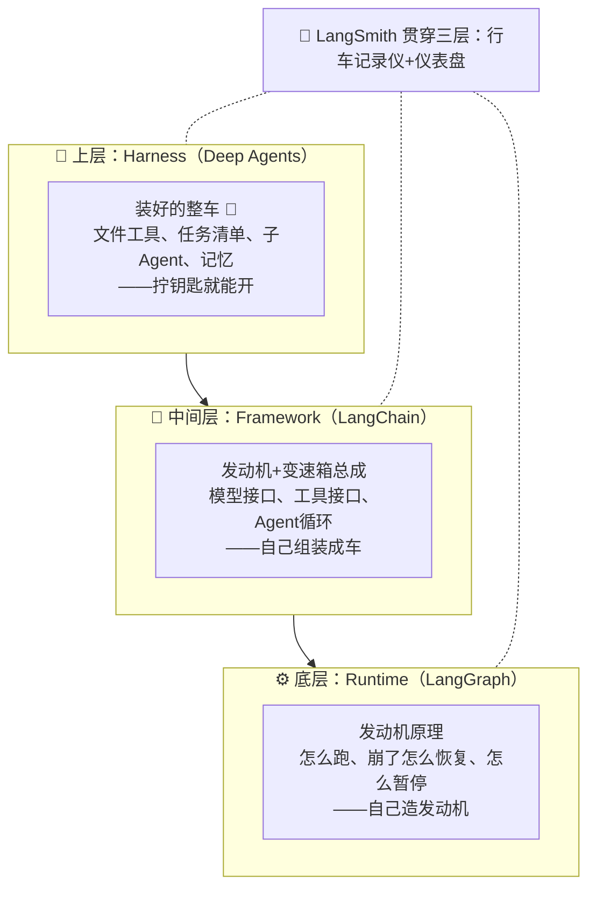

# 第 1 章白话笔记：从 Agent Framework 到 Agent Harness — Deep Agents 的诞生逻辑

> - 篇章：认知篇（Task 2）
> - 课程链接：https://datawhalechina.github.io/deepagents-in-action/chapters/ch01-agent-harness/
> - 学习日期：2026-09-14

## 一、先从一个场景说起

假设你想做一个「AI 帮我改代码」的助手。它得能看代码、定计划、一步步改、改不动时找人帮忙、还得记住你之前说过啥。

如果用 LangChain 从零搭，写完你会发现：手写文件读写工具、手写任务清单逻辑、手写子 Agent 调度……**而这些东西，几乎每个像样的 Agent 应用都得有一套**，每次都重写一遍。Deep Agents 就是来解决这个的。

## 二、三层结构：从「发动机」到「整车」



**底层 Runtime（LangGraph）= 发动机原理**。管「怎么可靠地跑」：崩了能从断点恢复（持久化执行）、流式输出、关键操作前暂停等人工审批。它是 Agent 世界的「操作系统」。

**中间层 Framework（LangChain）= 总成件**。在发动机之上给标准化零件：统一模型接口（一行换 DeepSeek/OpenAI/Claude）、工具接入规范、Agent 循环。不用碰底层，但车还得自己组装——工具自己写、任务清单自己管。

**上层 Harness（Deep Agents）= 装好的整车**。Claude Code、Manus、Cursor 这些能干活的 Agent 产品**长得都惊人地相似**：都会读写文件、都拆任务清单、都派子 Agent、都防「聊太久忘事」。这不是巧合，是复杂任务天生需要。Deep Agents 把这些被反复验证的能力预置好，拧钥匙就能开。

| 层次 | 代表 | 核心价值 | 什么时候用 |
| --- | --- | --- | --- |
| Runtime | LangGraph | 持久化执行、流式、人机协作、状态管理 | 需要精细控制的复杂工作流 |
| Framework | LangChain | 模型抽象、工具接口、Agent 循环、中间件 | 快速拼装标准 Agent 应用 |
| Harness | Deep Agents | 预置工具接口、子 Agent、长期记忆 | 自主干复杂活的高自动化 Agent |

三者是层层叠加，不是互相替代。**想精细控制用 LangGraph，想快速拼装用 LangChain，想自主干复杂活用 Deep Agents**。

## 三、灵魂概念：Context Engineering（上下文工程）

全章最重要的理念，直接解释了 Trace 分析里那条 29 秒慢调用。

```mermaid
flowchart LR
    subgraph old["❌ 传统：全塞进去"]
        direction TB
        U1["User: 帮我重构代码"] --> P1["Prompt:<br/>System + 提问 + 20个文件全文<br/>= 50000 tokens 💥"]
    end
    subgraph new["✅ Deep Agents：按需取用"]
        direction TB
        U2["User: 帮我重构代码"] --> F["虚拟文件系统 📁<br/>所有资料躺在这里"]
        F -->|"需要哪个读哪个<br/>read_file / grep"--> LLM2["LLM 上下文:<br/>只放当前步骤<br/>真正需要的内容"]
    end
```

一句话读图：**左边是「资料跟着对话走」，右边是「对话去资料那儿取」**。

传统做法（Prompt Stuffing）的三个死穴：**窗口装不下**（token 上限）、**注意力被稀释**（资料越多模型越抓不住重点）、**不可扩展**（项目一大直接崩）。

Deep Agents 的做法：给 Agent 配一个**虚拟文件系统**，让它像人一样干活——要读就 `read_file`（大文件可只读某几段 offset/limit）、要记就 `write_file`、要找就 `grep`/`glob`。上下文永远只留「当前这一步需要的」。

关键点：这个文件系统是**可插拔的**——内存（调试）、本地磁盘、数据库、远程沙箱都能当后端。Task 1 把 seekdb 换成 SQLite 时业务代码零改动，就是这个设计在真实运转。

> 联系 Trace 分析：Tavily 返回 30K 字符全文 → 灌进上下文 → LLM 慢 29 秒。那就是典型的「信息进错地方」——本该走文件系统按需取的资料，被直接塞进了对话。第 3 章会系统展开。

## 四、和竞品比：怎么选？

三大 Harness 能力面（文件、Shell、搜索、规划、子 Agent）都差不多，差异在：

| | Deep Agents | Claude Agent SDK | Codex SDK |
| --- | --- | --- | --- |
| 模型 | 无关（100+ 家） | 绑 Claude | 绑 OpenAI |
| 长期记忆 | ✅ 独有 | ❌ | ❌ |
| 独特能力 | 可插拔文件系统、Sandbox-as-Tool、生产部署方案 | Hooks 系统、Claude 深度集成 | OS 级沙箱、云端执行 |

选择逻辑：全家用 Claude 选 Claude SDK，全家用 OpenAI 选 Codex，**要模型自由 + 长期记忆 + 生产部署方案，选 Deep Agents**。

## 五、三句话记住本章

1. Agent 开发三层楼：LangGraph 打地基、LangChain 给零件、Deep Agents 交整车
2. Harness 存在的理由是「成功的 Agent 都长得一样」，把这些共性固化成开箱即用
3. Deep Agents 的灵魂是 Context Engineering——**别把资料塞给模型，给模型一个自己取资料的抽屉**

## 六、v0.7 注意事项与 TODO

- [ ] v0.7 后任务规划（Todo）需显式传 `TodoListMiddleware` 才启用，默认不再全开（第 2 章写代码会碰到）
- [ ] 文件工具新增了 `delete`；默认基础提示词为空，业务提示词由应用自己定义
- [ ] 配套视频：[Lec 01](https://www.bilibili.com/video/BV1CPXpBYEui/) / [Lec 02](https://www.bilibili.com/video/BV1Lm9FBfEXC/)
- [ ] 关联实验：trace 中看到的 FilesystemMiddleware / SubAgentMiddleware / SummarizationMiddleware 就是本章中间层「中间件」概念的真实案例
