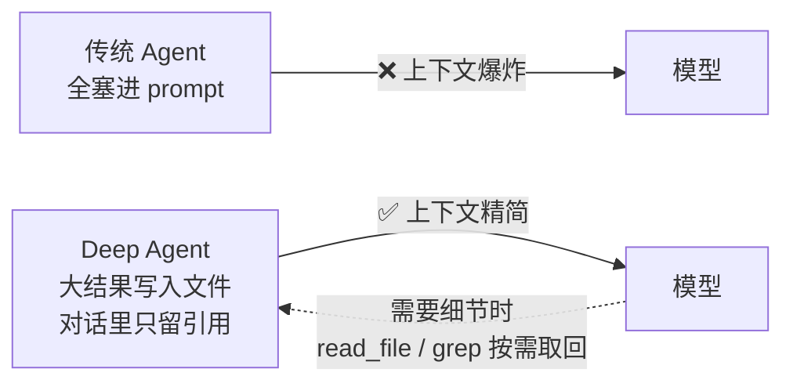
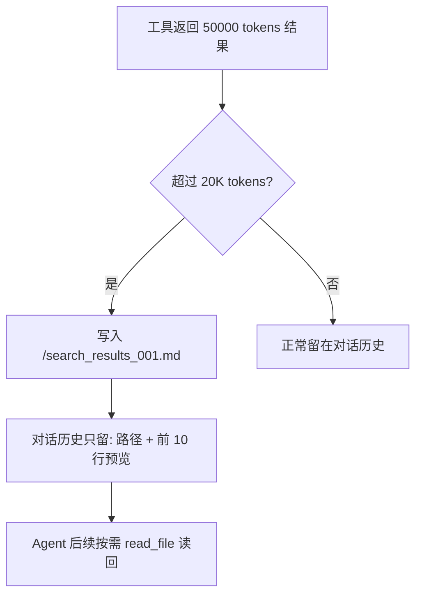
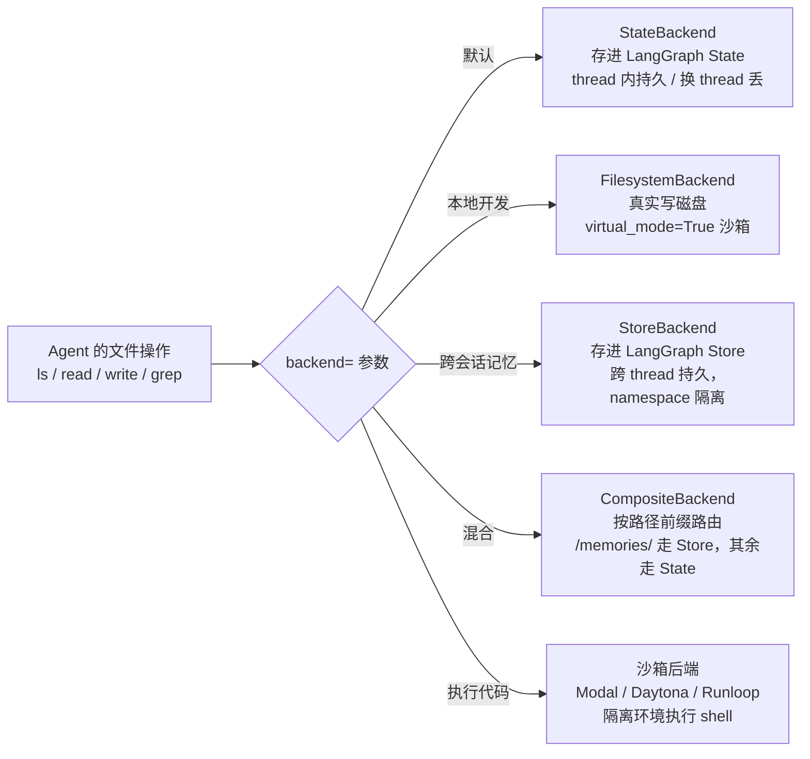

# 第 3 章笔记：虚拟文件系统 —— Deep Agents 的上下文管理核心

> 课程：Deep Agents 实战 ch03（Lec 04 虚拟文件系统与上下文管理 / Lec 05 可插拔存储后端）
> 实战代码：同目录 [ch03-experiments.py](./ch03-experiments.py)（5 个实验可直接复现）

## 一、白话版：为什么要给 Agent 一个"文件系统"？

### 1.1 以前的问题：所有东西都往脑子里塞

传统 Agent 的工作方式像一个人**把所有资料全部摊在桌子上**，还必须同时记住每一页的内容——文件内容、搜索结果、中间计算，全部塞进 prompt（对话历史）。结果是：

- 对话历史越滚越长，token 费用越来越高
- 模型注意力被稀释，重要信息淹没在噪音里（"lost in the middle"）
- 上下文窗口一满，前面的内容就被硬截断，Agent 直接"失忆"

### 1.2 Deep Agents 的答案：像人一样工作

想想你自己是怎么处理大量资料的：你**不会**把所有文件同时打开，而是分门别类存好，要用哪份翻哪份，找不到就搜索，重要结论记在便签上。

Deep Agents 给了 Agent 同样的能力——一套**虚拟文件系统**：



**核心理念**：上下文窗口是"桌面"，文件系统是"档案柜"。桌面上只放当前正在处理的东西，其余都进档案柜。

## 二、7 个内置文件工具

| 工具 | 用途 | 白话类比 |
|------|------|---------|
| `ls` | 列出文件和元信息 | 打开文件夹看看有什么 |
| `read_file` | 分片读取，支持偏移/行数限制 | 翻到第 100 页，读 50 行 |
| `write_file` | 创建或**完整覆盖**文件 | 写新备忘录（注意会覆盖！） |
| `edit_file` | 精确字符串替换 | 用红笔改文档 |
| `delete` | 删除文件（v0.7 新增） | 清理资料 |
| `glob` | 按模式找文件（`**/*.py`） | 按标签找文件 |
| `grep` | 按内容全文检索 | 全文检索 |

两个值得单独记的点：

1. **`read_file` 原生多模态**：png/jpg/mp4/mp3/pdf/ppt 都能直接读，Agent 能"看图"、"听录音"、"读 PDF"，不限于文本。
2. **`write_file` vs `edit_file`**：v0.7 中 `write_file` 会完整覆盖同路径文件；只改局部必须用 `edit_file`。用错了会丢数据。

## 三、上下文自动管理（本章精髓）

文件系统本身不稀奇，稀奇的是它和**两条自动机制**联动：

### 3.1 大结果自动卸载（Eviction）

工具输出超过阈值（默认 `tool_token_limit_before_evict=20000`）时，自动执行三步：

1. 完整内容**写入虚拟文件系统**（如 `/search_results_001.md`）
2. 对话历史中**替换为文件路径 + 前 10 行预览**
3. Agent 需要细节时 `read_file` 按需读回



这是**完全自动**的——Agent 和开发者都不用手动管理。我们实验四验证了这个机制。

### 3.2 对话历史总结（Summarization）

上下文达到阈值（默认模型窗口的 85%）时：

1. 旧消息**写入 Backend 保存**（供回查）
2. LLM 生成结构化摘要（意图/产出物/下一步）
3. 模型这次看到的输入换成"**摘要 + 近期消息**"

注意区分两样东西：**保存的历史文件**（用于回查细节）和**发给模型的摘要**（用于省 token）。摘要缩的是模型输入，不是把历史删了。

## 四、可插拔存储后端：文件到底存哪？

"虚拟文件系统"是抽象概念，具体存哪由 **Backend** 决定。这是本章的架构重点：



五个后端一句话总结：

| 后端 | 存哪 | 活多久 | 适合 |
|------|------|--------|------|
| `StateBackend`（默认） | LangGraph State | 同 thread 内 | 学习实验、Agent 草稿纸 |
| `FilesystemBackend` | 本地磁盘（root_dir 内） | 永久 | 本地编程助手、CI |
| `LocalShellBackend` | 磁盘 + 可执行 shell | 永久 | ⚠️ 仅个人信任环境 |
| `StoreBackend` | LangGraph Store | 跨 thread 永久 | 长期记忆、用户偏好 |
| `CompositeBackend` | 按路径路由组合 | 看路由目标 | 生产：草稿 + 记忆组合 |

### 安全要点（课程反复强调）

- `FilesystemBackend` 必须显式 `virtual_mode=True` 开启路径沙箱（挡 `..`、`~` 越界），0.6.0 起必填
- Agent 能读 `root_dir` 下**所有文件包括 .env 和密钥**，Web 服务场景不要用本地磁盘后端
- `LocalShellBackend` 无任何沙箱隔离，Agent 可以执行任意 shell 命令，绝对不能上生产
- `StoreBackend` 的 `namespace` 是必填参数，用于按用户隔离数据；本地 `invoke()` 时 `rt.server_info` 是 `None`，要写兜底

## 五、权限控制：FilesystemPermission

工具定义 Agent **能做什么**，权限决定**这次能不能做**。声明式权限三行配置：

```python
permissions=[
    FilesystemPermission(
        operations=["write", "edit"],
        paths=["/policies/**"],
        mode="deny",   # deny 直接拒绝 / interrupt 暂停等人工审批 / allow 显式放行
    ),
]
```

求值规则是 **first-match-wins**（按声明顺序，第一条同时匹配操作和路径的规则生效；没有规则命中则默认允许），所以**具体规则要放在宽泛规则前面**。

## 六、实验结果记录（本地复现）

用本地 deepagents 0.7.15 + Qwen2.5-7B 复现了 5 个实验（完整代码见 [ch03-experiments.py](./ch03-experiments.py)，支持 `python ch03-experiments.py 1 4` 分段重跑）：

| 实验 | 验证内容 | 结果 |
|------|---------|------|
| 实验一 | FilesystemBackend 编程调用 7 个操作 + `../` 越界 | ✅ 全部可用；越界抛 `ValueError: Path traversal not allowed`，沙箱生效 |
| 实验二 | StateBackend 同 thread 记得、换 thread 失忆 | ✅ thread-A 写入后能回忆；thread-B 的 state.files 为空 |
| 实验三 | FilesystemBackend 真实落盘 | ✅ Agent 写的 notes.md 真实出现在磁盘 root_dir |
| 实验四 | 大结果自动卸载 | ✅ 501 行 x 5 倍冗余的工具结果被转存到 `/large_tool_results/<uuid>`，对话历史只剩一句 "Tool result too large ... saved in the filesystem at this path" |
| 实验五 | CompositeBackend 路由 + deny 权限 | ✅ /tmp-note.md 落磁盘、/memories/preferences.txt 进 Store、/policies/secret.txt 返回 `Error: permission denied for write` |

实验四的实际输出（注意工具返回被替换成了什么）：

```
⚙️  [model] fetch_big_data({'keyword': 'LangGraph'})
✅ [tools] fetch_big_data -> Tool result too large, the result of this tool call
   01a0bff5... was saved in the filesystem at this path: /large_tool_results/01a0bff5...
📁 卸载后的 state.files: ['/large_tool_results/01a0bff5...']
```

## 七、我的踩坑与发现

1. **StateBackend 不能脱离图使用**：直接 `StateBackend().write(...)` 抛 `RuntimeError`，提示必须通过 `create_deep_agent` 在图执行内使用。想在图外测试用 `FilesystemBackend`。
2. **StateBackend 的文件在 `state["files"]`**：`agent.get_state(config).values` 里取 `files` 字典可以直观看到 Agent 存了哪些"虚拟文件"，key 就是虚拟路径。
3. **get_state 必须配 checkpointer 实例**：`agent.get_state()` 抛 `ValueError: Checkpointing is required...`；root graph 不支持 `checkpointer=True`，必须传 `InMemorySaver()` 实例（生产用 Sqlite/OceanBase 等持久化 saver）。
4. **结果对象的字段名有讲究**：`ReadResult.file_data` 是 **dict**（取 `["content"]`），不是对象属性；`GlobResult` 的字段叫 `matches`，`entries` 是 `LsResult` 的。编程调用后端时容易踩。
5. **实验四的数据量要真够大**：默认阈值是 20000 **token**；201 行 x 3 倍冗余不够触发，501 行 x 5 倍冗余才稳定触发。卸载路径固定是 `/large_tool_results/<工具调用id>`。
6. **namespace lambda 的元组优先级坑**：`(("local-user",) if x else identity,)` 这种写法尾逗号作用于整个三元表达式，None 分支返回 `(("local-user",),)`（元组套元组），运行时报 `TypeError: component must be a string, got tuple`。正确写法是两个分支各自成元组；且本地 `invoke()` 时 `rt.server_info` 是 `None` 必须兜底。
7. **免费档模型偶发长挂起**：Qwen 免费档某次调用挂了 10 分钟无响应。给 `ChatOpenAI(timeout=120, max_retries=3)` 后可自愈；实验脚本改成支持命令行分段重跑（`python ch03-experiments.py 4 5`）。
8. **CompositeBackend v0.7 破坏性变更**：`backend=` 只接受后端**实例**，`lambda rt: ...` 工厂函数已移除；但 `StoreBackend(namespace=lambda rt: ...)` 仍支持（它在运行时算命名空间，不是造后端）。

## 八、一句话总结

> Deep Agents 的虚拟文件系统 = 给 Agent 一个"档案柜 + 搜索引擎 + 便签纸"，配合"大结果自动卸载"和"历史自动总结"两条自动机制，让上下文窗口永远只放**当前需要**的内容；而可插拔 Backend 让同一套文件操作 API 可以从"临时草稿纸"平滑升级到"持久记忆库"，路径前缀就是路由规则。
