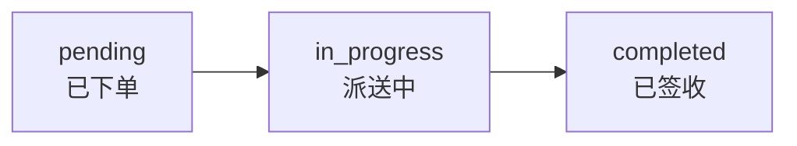
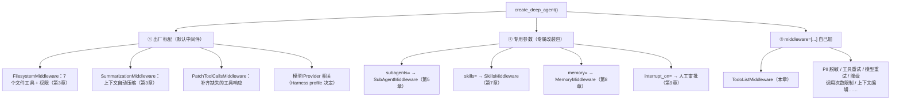
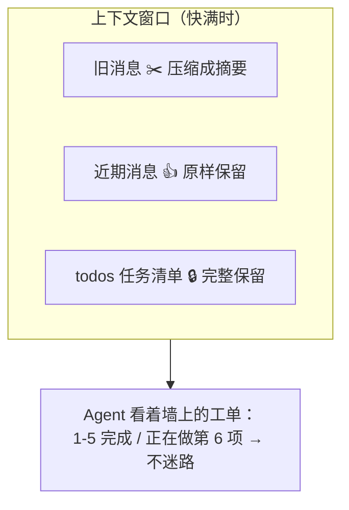

# 第 4 章笔记：任务规划与中间件机制 —— 让 Agent 学会"先写工单再干活"

> 课程：Deep Agents 实战 ch04（Lec 06 任务规划与中间件）
> 实战代码：同目录 [ch04-experiments.py](./ch04-experiments.py)（3 个实验，模拟数据库不联网，免费可复现）

## 一、白话版：为什么 Agent 需要"工单"？

没有规划的 Agent 像一个没拿工单就开工的装修工：铺了地板忘了走水电、同一面墙刷三遍（忘了刷过）、干到一半自顾自去装灯。对应 Agent 的四种典型翻车：**遗漏关键步骤、重复劳动、半途而废、质量不稳定**。

规划 = 给 Agent 一张能随时看、随时勾的**工单**（`write_todos` 工具），让"先思考再行动"变成显式流程：拆解任务 → 逐步执行 → 动态调整。

### 三个状态就是快递物流



Agent 收到复杂任务的典型三步：①先用 `write_todos` 写计划（全 pending）→ ②干活时状态流转（干一项勾一项）→ ③发现新情况就改工单（新增/删除条目）。

**关键认知**：(1) 工具存在 ≠ 模型会用，写了清单 ≠ 照单执行——行为质量取决于模型（第 2 章实测：GLM-5.2 规规矩矩每步更新，Qwen2.5-7B 写完清单转头就幻觉）；(2) `completed` 是 Agent 自己打的勾，**勾完 ≠ 做对**，应用必须验产物（报告生成了吗、引用能核实吗、代码过测试吗）；(3) 状态流转不是框架强制的状态机，模型可以自由改写清单。

## 二、v0.7 的变化：规划从"预装"变"自选"

v0.7 起默认**不再安装** TodoListMiddleware，需要显式传入：

```python
from langchain.agents.middleware import TodoListMiddleware

agent = create_deep_agent(
    model=model,
    middleware=[TodoListMiddleware()],  # 同时注入 write_todos 工具 + todos 状态 + 规划提示词
)
```

要不要开的决策表：

| 场景 | 建议 |
|------|------|
| 单步问答、短工具调用 | 别开，工单比活儿还长 |
| 长程、多阶段、容易漏步骤 | 开，并用真实任务验证完成率 |
| 能力较弱、容易丢主线的模型 | 先 A/B 评测，通常值得尝试 |
| UI 要展示计划/当前步骤/进度 | 必开，`todos` 就是产品状态协议 |

自定义配置：`TodoListMiddleware(system_prompt=..., tool_description=...)`，默认配置已含相当完整的指导（默认提示词里明确要求"完成后立即标记，不要攒批""结束前一刻保持至少一项 in_progress"等）。

## 三、揭开引擎盖：中间件 = Agent 的插件系统

第 1 章三层架构（Runtime→Framework→Harness）中的关键设计：LangChain 提供**中间件机制**，`create_deep_agent()` 的本质就是把一组中间件**自动组装**到 Agent 上。

### 能力的三个进货渠道



**同名替换规则**：`middleware=[...]` 里传入与默认同名的实例是**原位完整替换**（不是叠加，也不按字段合并）——替换后要重新验证权限、Backend、子 Agent 行为是否还符合预期。

### 两类 Hook：检查站 vs 包装纸

| 风格 | Hook | 执行方式 | 适合 |
|------|------|---------|------|
| Node-style | `before_agent` / `before_model` / `after_model` / `after_agent` | 编译成图中独立节点 | 校验、状态更新、审计、**人工中断** |
| Wrap-style | `wrap_model_call` / `wrap_tool_call` | 包裹调用，可不调/调一次/调多次 | 重试、缓存、降级、请求响应转换 |

对 `interrupt()` 的意义：Node-style 有清晰节点边界，暂停恢复时可推断哪些逻辑会重放；Wrap-style 在 model/tools 节点内部，恢复时可能连 handler 一起重跑——**人工中断的默认边界应放 Node-style**。

### 三个"修补/恢复"职责，按问题区分

| 遇到什么问题 | 找谁 | 注意什么 |
|------------|------|---------|
| 历史有工具调用但缺响应（上次运行被取消） | `PatchToolCallsMiddleware` 补一条"已取消"说明 | 不重试工具、不验证结果、不证明外部操作已撤销 |
| 工具抛可重试异常 | `ToolRetryMiddleware` | 写操作重试要考虑重复执行的副作用 |
| 下次运行接续上次状态 | Checkpointer + 同 `thread_id` | Checkpointer 是 LangGraph 运行时机制，不属于 middleware |
| 工具返回了但内容对不对 | 应用自己的校验/评测/人工审核 | 调用成功、清单完成都不等于正确 |

### 两个同名 SummarizationMiddleware

| 对比项 | LangChain 版 | Deep Agents 版 |
|--------|-------------|----------------|
| 执行位置 | `before_model`，图中独立节点 | `wrap_model_call`，model 节点内部 |
| 摘要后消息 | 直接**替换** `state["messages"]` 为摘要 | **保留原始消息**，另存摘要；模型输入=摘要+近期消息 |
| 历史保存 | 不写 Backend | 旧消息写入 Backend，摘要附保存路径 |

**坑：两个同名类的 `trigger` 默认都是 `None`，不会主动摘要**。`create_deep_agent()` 会配置默认触发条件（已知窗口时 85%）；手动 `create_agent(middleware=[...])` 组装不会自动获得。**图里有摘要节点 ≠ 摘要已触发**。触发类型：`("tokens", N)` / `("messages", N)` / `("fraction", 0.85)`（需模型 profile 支持）。Deep Agents 版还有第二条触发路径：模型调用抛 `ContextOverflowError` 时摘要后重试。

## 四、规划的"锚定"作用（与第 3 章的协同）

长任务做到第 6/10 步时：前 5 步的搜索结果被大结果卸载、旧消息被压缩成摘要，模型实际看到的是"摘要 + 近期消息"。**但 `todos` 字段永远原样保留**（默认对话总结不删它）——这份清单就是 Agent"失忆"后的锚：细节可以忘，但"走到哪一步、下一步干什么"永远在线。



这也是前两章知识串起来的闭环：**文件系统管"细节放哪"（档案柜），规划管"全局走到哪"（工单），上下文管理管"眼前看什么"（桌面）**——三者合起来才是完整的 Context Engineering。

### todos 持久化的边界

- 同一次运行内：后续步骤可访问清单
- 跨多次 `invoke()`：需要 Checkpointer + 同 `thread_id`（只加 TodoListMiddleware 不够）
- 跨进程重启：`InMemorySaver` 不行，要数据库级 Checkpointer
- 子 Agent：`general-purpose` 继承主 Agent 的 Todo 配置但**独立维护清单**；`subagents=[...]` 声明的子 Agent 有独立中间件栈，要规划得自己 spec 里开

## 五、实验结果记录（本地复现）

本地 deepagents 0.7.15 / langchain 1.4.1 + Qwen2.5-7B（免费档），用**不联网的模拟手机参数库**代替 Tavily（快、免费、结果确定），完整代码见 [ch04-experiments.py](./ch04-experiments.py)，支持 `python ch04-experiments.py 1 2` 分段重跑：

| 实验 | 验证内容 | 结果 |
|------|---------|------|
| 实验一 | TodoListMiddleware 开/关对比 | ✅ A 组（默认）：无 todos 状态、直接查 3 次参数完成；B 组：先写 5 项清单 → 逐项推进到 ✅✅✅🔄⬜，最终回答两组都覆盖 3/3 品牌 |
| 实验二 | todos 跨 invoke 接续（Checkpointer + 同 thread_id） | ✅ 第 1 次调用后 5 项全 pending；第 2 次 invoke 读到旧清单并更新到 ✅✅✅🔄⬜ 接着干 |
| 实验三 | SummarizationMiddleware 触发观察（trigger=("messages",6)） | ✅ 历史条数封顶在 4 条不增长；第 1 条被替换为摘要 HumanMessage（SESSION INTENT + SUMMARY 结构） |

实验一实测对比（同一任务同一模型，唯一区别是 middleware）：

```
A 未开启规划: 查参数 3 次 | write_todos 0 次 | 清单 0 项 | 覆盖品牌 3/3
B 开启规划:   查参数 4 次 | write_todos 2 次 | 清单 5 项 | 覆盖品牌 3/3
```

两个真实观察：① 这个任务对 Qwen 不算复杂，A 组反而更简洁——印证课程决策表"简单任务别开"；
② B 组查了 4 次参数（Zenith 重复查了一次）且清单没全勾完——**规划不是银弹**，它给了追踪载体，但执行质量仍取决于模型。

实验三实测输出（摘要真的发生了）：

```
第3轮后 历史共 4 条: [HumanMessage, AIMessage, ToolMessage, AIMessage]  ⚡ 已触发摘要
第4轮后 历史共 6 条                                                      （重新增长）
第5轮后 历史共 4 条  ⚡ 再次触发

历史第 1 条是 HumanMessage：
'Here is a summary of the conversation to date:\n\n## SESSION INTENT\n\n查询手机参数\n\n## SUMMARY\n\n- 查了 Aurora 手机的参数：价格 4999 元……'
```

## 六、我的踩坑与发现

1. **提示词和能力必须一致，否则模型会幻觉调工具**：首轮实验 A 组（未装 Todo）复用了含 "先用 write_todos…" 的提示词，Qwen 真的对这个**未注册的工具发起了空参数调用**。A/B 对比时提示词也要控制变量。
2. **`write_todos` 的参数就叫 `todos`**：观察工具调用时取 `tc["args"].get("todos", [])`，每项是 `{"content": ..., "status": ...}`，打日志只打状态摘要（⬜/🔄/✅）避免刷屏。
3. **LangChain 版 TodoListMiddleware 的默认提示词值得一读**：里面明确写了"完成后立即标记，不要攒批""任何时刻至少保持一项 in_progress（除非全部完成）""write_todos 本身不是答案，最终答案必须在消息里"——自定义 system_prompt 前先看默认的。
4. **手动组装 SummarizationMiddleware 必须设 trigger**：默认 `None` 永不触发，且是**静默**的（不报错），很容易以为"装上了就在工作"。观察触发的方法：按轮次打印 `state["messages"]` 类型列表，**条数封顶不再增长**就是触发证据。
5. **摘要消息是一条 HumanMessage**：LangChain 版触发后摘要以 HumanMessage 形式写回历史开头，内容是结构化的 `SESSION INTENT` + `SUMMARY` 两段。触发条件会**反复满足**（第 3 轮、第 5 轮各触发一次），不是一次性的。
6. **get_state 处处要 checkpointer**：第 3 章的坑在本章连咬三口——实验一/二/三的 agent 都要传 `InMemorySaver()`，否则 `ValueError: No checkpointer set`。凡是想用 `get_state` 观察/统计，创建 agent 时就带上 checkpointer。

## 七、一句话总结

> 第 4 章 = 一张工单 + 一套插件系统：`write_todos`（TodoListMiddleware）让 Agent 先拆解再执行、进度可追踪可展示；中间件机制解释了 Deep Agents 全部能力的装配方式（默认标配 / 专用参数 / 手动加入）；而 `todos` 在上下文压缩下的锚定设计，让任务规划和第 3 章的上下文管理形成闭环——工单（全局进度）+ 档案柜（细节存档）+ 桌面（当前焦点）三者协同才是完整的 Context Engineering。
