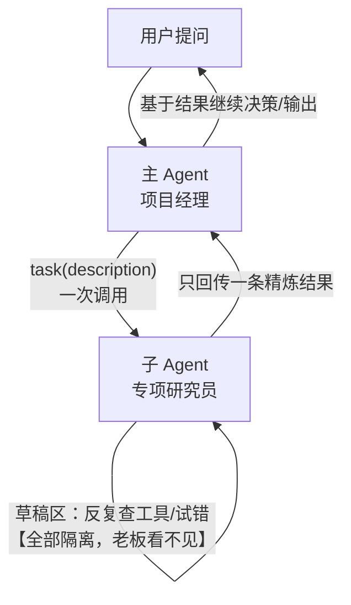
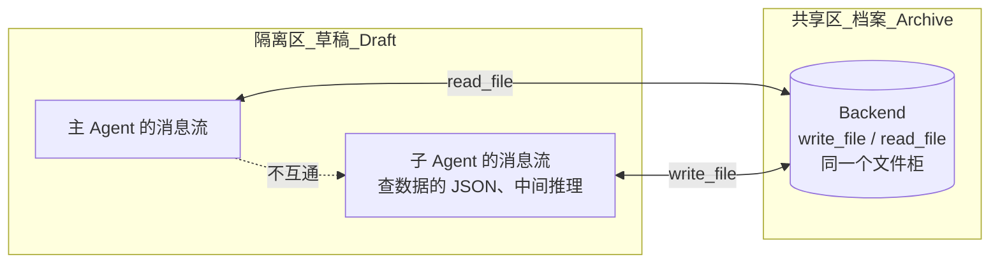
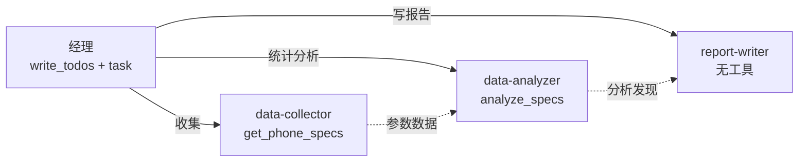

# 第 5 章笔记：子 Agent 与上下文隔离 —— 让领导只管拍板，不听流水账

> 课程：Deep Agents 实战 ch05（子 Agent 与 Context Quarantine）
> 实战代码：同目录 [ch05-experiments.py](./ch05-experiments.py)（2 个实验，模拟数据库不联网，免费可复现）

## 一、白话版：领导的注意力是全公司最贵的资源

想象一个老板，任何下属干活他都要全程旁听：实习生查资料他在旁边看着、会计核对每张发票他盯着、前台接电话他也要听一耳朵——不出三天，老板的脑子就塞满了，真正该想的战略反而没地方放了。

Agent 一样：主 Agent 的上下文窗口（也就是它的"脑容量"）是**最贵的资源**。每次工具调用返回一大坨 JSON、每一轮中间推理，全都往里塞。塞满了会发生什么？早期内容被挤出注意力、模型开始丢细节、答非所问——这正是前面章节讲 Context Engineering 的原因。

子 Agent 的解法很朴素：**老板不见工人，只见工头**。

主 Agent 通过 `task` 工具把任务派出去，子 Agent 在**自己独立的上下文**里随便折腾——查十次数据、推翻重写三次草稿都行——最后只把一条最终结果交回来。中间过程对主 Agent 完全不可见。

## 二、Context Quarantine：隔离的是"草稿"，共享的是"档案"

这是本章最容易被误解的点（我一开始也理解偏了）：隔离**不是**把子 Agent 关进孤岛，而是只隔离**消息流**，Backend 文件是**共享**的：

- **草稿（消息流）**：子 Agent 自己的对话历史，查出来的原始 JSON、每一步推理，全部留在自己家里，主 Agent 看不见 → 消息隔离 = 主上下文不被撑爆
- **档案（Backend 文件）**：主 Agent 和子 Agent 共用同一个 `backend`（第 3 章的文件系统）。子 Agent `write_file` 写的文件，主 Agent 可以随时 `read_file` 拿回 → 档案共享 = 重要的东西有地方存、随取随用

一句话：**喧嚣的过程被隔离，沉淀的产物被共享**。

### 源码佐证：文件工具是自动配发的，和 tools 参数无关

我一开始怀疑：给子 Agent 传 `tools=[get_phone_specs]` 会不会把 `write_file` 也替换掉（第 4 章学过同名中间件"全替换"规则）？翻源码 `deepagents/graph.py` 发现想多了——

每个字典定义的子 Agent 都会被**自动注入** `FilesystemMiddleware(backend=共享backend)`，也就是说文件工具（write_file/read_file/ls/glob/grep/edit）是**自动配发**的。`tools=[...]` 参数只管**业务工具**这一条通道：不写就继承主 Agent 的，写了就全替换；文件工具走的是另一条通道，不受影响。（想精细控制子 Agent 的文件工具，才需要在它的 `middleware` 里显式放一个 `FilesystemMiddleware(tools=...)`。）

## 三、子 Agent 的三种形态

| 形态 | 怎么写 | 特点 |
|------|--------|------|
| 字典定义（本章主角） | `{"name", "description", "system_prompt", "tools", ...}` | 声明式，框架自动组装 |
| general-purpose（默认自带） | 不用写，v0.7 默认注入 | 继承主 Agent 的一切，通用兜底 |
| CompiledSubAgent（预编译图） | 传入 LangGraph 图 | "换整个人"：确定性流水线 |

字典定义的继承规则要背下来：

- `tools`：不写 → 继承主 Agent 的工具；写了 → **全替换**（不是合并）
- `system_prompt` / `middleware` / `skills`：**从不继承**，必须自己写全——子 Agent 不知道主 Agent 的提示词里有任何内容
- `model`：不写用主 Agent 的；可指定别的模型（"换脑子"：便宜的活派实习生，难的活派专家）
- `permissions`：不写继承主 Agent 的；写了全替换

而 CompiledSubAgent 是"换整个人"：直接把一段 LangGraph 工作流（带分支/循环/并行）当作子 Agent 交给 `task` 调用，流程完全确定，不给模型自由发挥的空间。两者取舍：字典子 Agent 灵活但行为随模型波动；预编译图确定但要自己写流程。

## 四、实验结果记录（本地 Qwen2.5-7B 复现）

### 实验一：量化 Context Quarantine —— 亲自干 vs 委派干

同一个调研任务（对比三款手机参数 + 分人群购买建议），A 组主 Agent 亲自查，B 组委派给 researcher 子 Agent（要求原始数据写入 `/data/raw.txt`、只回传精简摘要）：

| 指标 | A 亲自干 | B 委派干 | 说明 |
|------|---------|---------|------|
| 主上下文消息数 | 6 条 | **4 条** | B 只有一问一答 + task 调用/结果 |
| 主上下文总字符 | 967 | **459** | **只有 A 的 47%** |
| 主上下文工具调用 | 3 次（查三款） | **1 次**（task） | 中间三连查被隔离 |
| 含原始字段 battery_mah | True | **False** | 草稿隔离 ✅ 子 Agent 查的 JSON 没进主上下文 |
| 档案 /data/raw.txt | —（没存过档） | **落盘，覆盖品牌 3/3、关键数字齐全** | 档案共享 ✅ write_file 真实写到磁盘 root_dir |

**这个实验跑了三轮才达标，中间两轮的失败比成功更值钱：**

1. **第 1 轮：子 Agent 压根不写档案。** 排除了"工具被替换"（见第二节源码分析）后确认就是弱模型跳步——`system_prompt` 里写了"把数据写入 /data/raw.txt"，Qwen 查完数据直接回摘要了。修复：把写档案设为**硬性关卡**（"第 2 步完成之前，禁止输出最终回复"），并要求回复以"原始数据已写入 /data/raw.txt"开头锚定格式。
2. **第 2 轮：档案写了，隔离却被经理自己拆了。** 子 Agent 的摘要精简到只有一句"已写入文件"，经理发现手里没有数据写不了建议，于是**自己 read_file 把原始数据整份拉回主上下文**——B 组反而膨胀到 A 组的 134%，battery_mah 也出现在主上下文里。教训：**交接摘要不是越短越好，精炼到"对方缺信息"就会逼他回读档案，隔离效果被自己抵消**。修复：要求摘要带上每款手机的关键数字，经理的提示词明确"基于摘要干活，不要自己读原始文件"。
3. **第 3 轮（最终）：47% + 两项边界验证全过。**

### 实验二：三部门协作 —— collector → analyzer → writer

经理（带 TodoListMiddleware）+ 三个专员子 Agent，各配最小权限工具：

实际运行：经理先写工单 → 三次 `task` 委派**顺序完全正确**（收集 → 分析 → 写作），每次只收到一份精炼交接物 → 最终输出报告。这次经理还展现了动态规划：把最初的单条工单边干边拆成三步、逐步推进状态（比第 4 章实验"写完清单永不更新"的表现好一截——子 Agent 任务结构更清晰时，弱模型的规划行为也会变好）。

**但有个稳定复现的坏消息：接力传话失真。** data-analyzer 两轮运行都输出了错误数字（把最轻的手机说成 Aurora/165g——真实数据里最轻的是 Zenith/172g，165g 根本不存在；电池最大说成 Zenith——实际是 Nimbus）。它手里的 `analyze_specs` 是确定性统计工具，输入数据也是对的，但弱模型在"工具结果 → 人话转述"这一步仍然会编数字。

> 这就是多级 Agent 的固有风险：**每多一跳传话，就多一次失真机会**。缓解手段：关键数字用确定性工具生成并原样引用；交接用结构化输出（response_format）；或者以档案文件为准、终稿前回读校对。

## 五、我的踩坑与发现

1. **弱模型会跳步执行多步指令**：system_prompt 里列三步它只做一和三。对策是把必做步骤设成硬性关卡（"完成 X 之前禁止回复 Y"），比"请记得做 X"有效得多。
2. **摘要太瘦会逼管理者回读档案**：隔离不是把信息变没，是把信息搬走——摘要必须自足（关键数字在内），否则主 Agent 一次 read_file 就把隔离收益吐回去。
3. **验证别认"格式"要认"数据"**：让子 Agent 存"JSON 原文"，它存成了中文排版行——数据全在但字段名没了。检查档案内容时认品牌覆盖数 + 关键数字，别认字段名。
4. **子 Agent 的内部动作不会出现在主 Agent 的流里**：`stream()` 只能看到一次 task 调用 + 一条结果，三连查、写文件全被隔离——这正是 Quarantine 的直接体现（想看子过程要开 LangSmith trace）。
5. **文件工具自动注入，不怕 tools 替换**：见第二节，graph.py 给每个字典子 Agent 自动配发共享 backend 的文件工具。
6. **grep 工具是字面匹配不是正则**：经理幻觉调用 `grep('Aurora|Nimbus|Zenith')` 得到 No matches——`|` 被当普通字符。第 3 章的知识点在多 Agent 场景又撞上了。
7. **传话链路就是失真链路**：见实验二，`completed` 是 Agent 自己打的勾、转述是 Agent 自己编的话——应用层对多级交接的每份数据都要有校验手段。

## 六、一句话总结

> 子 Agent = 把"喧嚣的过程"外包出去、把"沉淀的产物"存进共享档案柜：消息流隔离让领导的脑容量只花在决策上，Backend 文件共享让重要的东西永远找得回——而交接摘要写多精炼，决定了这套隔离是真省钱还是假省钱。
