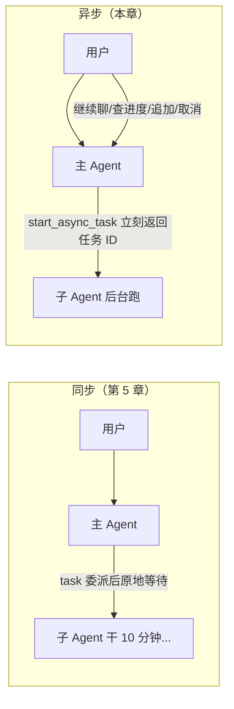

# 第 6 章笔记：异步子 Agent —— 从"等外卖"到"拿取餐号"

> 课程：Deep Agents 实战 ch06（Async Subagent，deepagents>=0.5.0 预览特性）
> 实战代码：同目录 [async-demo/](./async-demo/)（本地单部署 + ASGI 最小验证方案，免费模型可复现）

## 一、白话版：同步的"甩手掌柜"还是会被拖住

第 5 章的 `task` 委派是**同步**的：主 Agent 打电话点外卖，然后站在店门口干等。研究员在小房间跑 10 分钟，这 10 分钟里主 Agent 被阻塞，用户只能盯着转圈圈；跑到一半想改需求（"换个数据源"）也插不进嘴。

异步子 Agent 把"堂食等上菜"换成"外卖小程序下单"：



**判定法则：5 秒内能完成的子任务用同步；跑几分钟以上且过程要互动的，上异步。**

## 二、最大的观念转变：得先有一个"平台"

前几章都是一个 Python 进程 `agent.invoke()` 就完事。异步要求**子 Agent 由服务端承接**（主进程死了任务也得活着），所以引入了一组新概念：

| 名词 | 职责 | 类比 |
|------|------|------|
| Agent Protocol | 调 Agent 的 API 规范（建会话/启动/查状态/取消） | 外卖平台的接口标准 |
| Agent Server | 真正跑任务的运行服务 | 后厨 + 取餐系统 |
| `langgraph dev` | 一条命令启动本地 Agent Server | 开一家本地小店 |
| LangSmith | 观测/部署平台能力 | 后厨监控 + 连锁中央厨房 |

两个关键词别混淆：服务端的 **thread 是"会话"（存消息和状态），不是操作系统线程**；**run 是该会话上的一次执行**。一次异步任务 = 新开一个 thread + 发起一次 run。

## 三、5 把"遥控器"与它们的底层行为

声明 `AsyncSubAgent(name, description, graph_id)` 后，`AsyncSubAgentMiddleware` 自动给主 Agent 注入 5 个工具：

| 工具 | 表面动作 | 底层实际做了什么 |
|------|---------|----------------|
| `start_async_task` | 启动后台任务 | 在服务端**新建 thread + 启动 run**（"launch"），立刻返回 thread ID 作为任务 ID，**不轮询等待** |
| `check_async_task` | 查进度 | 读 run 状态；完成就读 thread state 取最终输出 |
| `update_async_task` | 追加指令 | 在**同一 thread** 上以 interrupt 多任务策略发起**新 run**——旧 run 被打断，子 Agent 带着**完整历史 + 新指令**重跑，任务 ID 不变 |
| `cancel_async_task` | 取消 | `runs.cancel()` 终止远程 run，本地标记 cancelled |
| `list_async_tasks` | 总览 | 已结束的从缓存返回，运行中的并发拉实时状态 |

### 任务 ID 为什么要住在独立的 state 通道里？

对话历史快满时会被**自动压缩**（第 3 章）。如果任务 ID 只活在某条工具消息里，压缩后主 Agent 就"忘了自己点过什么菜"。所以元数据放在独立的 `async_tasks` 通道——和 todos、虚拟文件系统是同一套哲学：**会被截断的放消息历史，必须长存的进 state**。

本地实测（爬 thread state 拿到的真实数据）：state 顶层只有 `async_tasks` / `files` / `messages` 三个 key，登记板内容：

```json
{
  "01a0e6f2-cb60-...": {
    "task_id": "01a0e6f2-cb60-...", "agent_name": "researcher",
    "run_id": "01a0e6f2-edda-...", "status": "success",
    "created_at": "...", "last_checked_at": "...", "last_updated_at": "..."
  },
  "01a0e6f3-47d9-...": { "status": "cancelled", ... }
}
```

## 四、两种传输：ASGI vs HTTP

```
HTTP 传输：SDK → 网络连接 → Uvicorn → Agent Server   （跨机器/远程部署，AsyncSubAgent 里写 url）
ASGI 传输：SDK → 进程内 ASGI 适配器 → Agent Server      （同部署，SDK 到应用不走网络）
```

本地起手式就是 ASGI：主 Agent 和子 Agent 注册在**同一份 `langgraph.json`，`AsyncSubAgent` 不写 `url`**。零网络延迟、零鉴权配置，子 Agent 依然有独立 thread（隔离性不打折）。**注意：ASGI 传输要求主 Agent 走 `ainvoke()` 等异步入口**，同步 `invoke()` 不行。

## 五、实验设计与结果（本地 Qwen2.5-7B 复现，一次全过）

### 实验设计（[async-demo/](./async-demo/) 五件套）

- **researcher**：纯 LangGraph、不调 LLM——固定 `sleep(8)` 的"故意很慢"研究员。为什么假？真实调研耗时不可控，实验要的是**稳定复现** `start 秒回 → running → success` 这条生命周期曲线；结论用第 3-5 章的手机参数库确定性计算（min/max），**机制本身才是观察对象**。
- **supervisor**：`create_deep_agent` + 一个 `AsyncSubAgent(graph_id="researcher")`，system_prompt 写死六条遥控器使用规则（最关键的一条：**派完活立刻返回，禁止自己轮询**——否则弱模型 start 完立刻 check，把异步优势吃掉）。
- **run_demo.py**：SDK 连本地 Server，同一会话七轮对话，每轮记录耗时（耗时=阻塞感的量化）。

### 七轮结果

| 轮次 | 用户干什么 | 耗时 | 观察到什么 |
|------|-----------|------|-----------|
| 1 派活 | 调研三款手机 | **4.0s** | 立刻拿到任务 ID（<< 8s，非阻塞生效 ✅） |
| 2 闲聊 | 解释同步/异步区别 | 1.9s | 后台跑着照样秒答 ✅ |
| 3 查进度 | 进展如何？ | 3.2s | `running`，"大约还需 8 秒" ✅ |
| 4 追加要求 | 结论整理成 3 条要点 | 4.4s | 走 update，任务 ID 不变，没有重开 ✅ |
| 5 取结果 | （等 10s 后）看结果 | 5.1s | `success` + 结论 3 条要点 + **数字全对** |
| 6 任务总览 | 列出所有任务 | 3.6s | list 返回 1 个 success 任务，ID 与第 1 轮一致 ✅ |
| 7 新任务+取消 | 派新调研立刻取消 | 7.1s | start + cancel 组合成功 ✅ |

两个特别值得记录的现象：

1. **update 的"带历史重跑"是真的**：第 4 轮追加"整理成 3 条要点"后，第 5 轮取回的结果正好是 3 条——追加指令穿透到了后台任务的最终产物里。
2. **结论数字全对不是模型的功劳**：最便宜 Nimbus/3599、电池最大 Nimbus/6000mAh、最轻 Zenith/172g，全来自 researcher 里确定性 min/max 计算第 5 章"接力传话失真"的教训——**把算数交给代码，把转述留给模型**。

## 六、复现步骤

```bash
# 1. 环境准备（本仓库已是 uv 管理的 venv）
uv pip install --python .venv/bin/python "langgraph-cli[inmem]"   # 提供 langgraph dev 命令

# 2. 配置密钥（不入库）
cd notes/task6-ch06-ch07/async-demo
cp .env.example .env   # 填入 SILICONFLOW_API_KEY

# 3. 启动本地 Agent Server（两个 graph 都从 langgraph.json 加载）
langgraph dev --n-jobs-per-worker 4 --no-browser     # 默认 http://127.0.0.1:2024

# 4. 另开一个终端跑七轮验证
python run_demo.py
```

判定跑通的四条标准（对照课程）：派活轮耗时远小于 8 秒；进度从 running 变 success；追加要求不重开任务；取消后状态 cancelled。

## 七、我的踩坑与发现

1. **Worker 槽位要够**（`--n-jobs-per-worker 4`）：本地默认 10 一般够，但槽位不够时"启动子任务"会长时间不返回——主 Agent 占了坑，子 Agent 在队列里干等。这是课程 FAQ 的头号问题。
2. **graph_id 必须与 `langgraph.json` 的键名一字不差**，拼错就是"找不到 graph"。
3. **不写 `url` 才走 ASGI**；写了 url 就是 HTTP 远程传输，需要鉴权配置。
4. **system_prompt 必须明确"派完立即返回、禁止自己轮询"**——不写的话弱模型 start 完马上 check，等于自己把异步退化成同步。
5. **不要给 supervisor 传 checkpointer**：`langgraph dev` 服务端自带持久化。
6. **`.env` 绝不能进仓库**：加 .gitignore，入库只放 `.env.example`。
7. **pip 的坑（环境相关）**：本仓库 venv 由 uv 创建，`pip` 命令会解析到别的解释器；查包/装包统一用 `uv pip --python .venv/bin/python`。
8. **成本观感**：7 轮对话里 supervisor 只做路由和转述，LLM 调用都很轻——异步模式把"重活"留给了不需要 LLM 的确定性部分，这本身就是好架构的信号。

## 八、一句话总结

> 异步子 Agent = 把"委派"从一通占线的电话换成一张**外卖小票**：start 拿号走人、check 随时看单、update 中途加备注、cancel 想退就退，而所有小票钉在**独立的登记板**（async_tasks 通道）上——对话记忆随便压缩，老板永远记得点过哪些菜；代价是架构升一级，得先有 Agent Server 这个"外卖平台"来接单。
