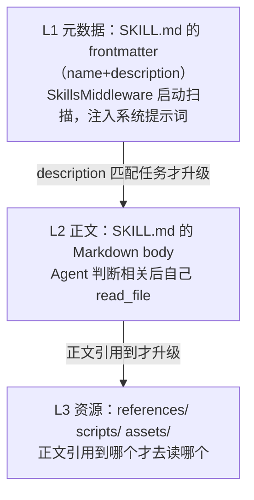

# 第 7 章笔记：Skills —— 可复用的 Agent 能力包

> 课程：Deep Agents 实战 ch07（Skills，遵循开放的 Agent Skills 规范 agentskills.io）
> 实战代码：同目录 [ch07-skills-experiments.py](./ch07-skills-experiments.py)（3 个实验，Skill 文件由脚本现场生成，免费模型可复现）

## 一、白话版：Tools 是手脚，Skills 是挂在墙上的 SOP 手册

工具（Tools）解决"一次原子操作"：查一次参数、读一个文件。但"按团队规范做代码审查"这种事需要的是**多步骤流程 + 领域知识 + 模板资源**的组合——这就是 Skill：一个目录，核心是一份 `SKILL.md`（frontmatter 元数据 + 给 Agent 看的操作剧本），外加可选的 `scripts/`（可执行脚本）、`references/`（参考文档）、`assets/`（模板资源）。

它是开放行业标准（30+ 工具已采纳：Claude Code、Codex、Cursor、GitHub、Databricks……），定位类比 **npm 包之于 Node.js**——写一次，处处能用，团队知识不锁死在某个工具里。

## 二、灵魂机制：渐进式披露（Progressive Disclosure）

50 本手册不能全塞进脑子，所以像图书馆一样**书脊上架，想看再抽**：

好处：省 token（50 个 Skill 启动只花几百 token 的"书脊"）、精准（无关剧本不进上下文不干扰）、可扩展（数量增长只线性增加书脊）。

**由此推出本章第一军规：description 是唯一的路由依据。** Agent 选 Skill 只看书脊、绝不提前读正文，所以 description 必须写清"什么时候用我"（✅"对比手机参数时使用" ❌"一个有用的技能"），否则漏召回/误召回。

## 三、实验结果记录（本地 Qwen2.5-7B）

### 实验一：三级加载实测 ✅（机制全链路打通）

Agent 挂两个 Skill（phone-analysis 分析规范 + report-writing 写作规范），问"按照可用的技能规范对比 Aurora 和 Nimbus"：

| 验证项 | 结果 |
|--------|------|
| L1 书脊先行：系统提示词含 Skill 名/描述、**不含**正文 | ✅（三项全中） |
| L2 匹配读正文：read_file 了 `/skills/phone-analysis/SKILL.md` | ✅ |
| L3 按需读附录：read_file 了 `references/scoring.md` | ✅ |
| 精准性：report-writing 的 SKILL.md 没被误读 | ✅ |
| 附录真的被用上：最终回答精确引用写死分数（8.5/7.8） | ✅ |
| 按规范以【手机分析报告】开头 | ❌（弱模型跳过格式要求，与第 4 章"清单没全勾"同款现象） |

执行轨迹完整还原：**读 SKILL.md → 逐款 get_phone_specs → 读评分附录 → 输出引用了附录分数的对比结论**。附录分数是代码写死的，出现在回答里= L3 加载真实发生了，这是比"看见了 read_file 调用"更强的证据。

### 实验二：同名分层覆盖（last wins）✅ 完美

`skills=["/skills/shared/", "/skills/project/"]`，两层各放一个同名 phone-analysis（正文标记不同：【共享版报告】 vs 【项目版报告】）：

- Agent 只读了 **`/skills/project/`** 的 SKILL.md（靠后的路径胜出）✅
- 最终回答以**【项目版报告】**规范输出 ✅，没有误用共享版
- 截获的系统提示词里，该 Skill 的"书脊"指向**项目版** ✅

这就是组织级/团队级/项目级知识分层的技术底座：同名即覆盖、就近生效。

### 实验三：Skill 只读保护 ✅ 完美

`FilesystemPermission(operations=["write","edit","delete"], paths=["/skills/**"], mode="deny")`：

- A. 让它改 SKILL.md：`edit_file -> Error: permission denied for write on /skills/...`，**手册原文未被篡改** ✅（能 ls、能 read，就是不能改——企业知识库场景）
- B. 对照组往 `/notes/todo.md` 写便签：write_file 正常落盘 ✅（权限只作用于 /skills/**，first-match-wins 未命中默认放行）
- 把 `mode` 换成 `"interrupt"` 就是"修改需人工审批"（第 9 章 HITL 预演；需配 checkpointer）

## 四、我的踩坑与发现

1. **"书脊"注入是请求时的，get_state 里翻不到**：SkillsMiddleware 在 `wrap_model_call` 时把元数据临时拼进系统提示词，**不持久化进 state 消息**。要验证 L1 必须自己写一个截获中间件（`AgentMiddleware.wrap_model_call` 里把 `request.system_message` 存下来），抓"模型实际看到的"而不是"state 里存的"。
2. **弱模型有工具就直奔工具、跳过手册**：不点名的提问（"帮我对比 A 和 B"）它直接连调 get_phone_specs 完事；把提问改成"**按照可用的技能规范**……"才触发先读 SKILL.md。硬性关卡措辞（"读完之前禁止调用其他工具"）对 7B 也常常扭不过工具本能——**Skill 触发可靠性高度依赖模型档位**，description/提示词只是下限保障。
3. **Skill 正文里引用的工具必须真的注册**：正文让调 get_phone_specs 而 Agent 没这工具时，报错后模型开始幻觉出 `references/parameters/` 之类的假文件反复 grep——又是第 2 章的老病："提示词提到、注册表没有"= 幻想过载。
4. **格式要求类指令容易被跳过**：机制步骤（读文件、调工具）都执行了，唯独"第一行必须是【XX】"没做——弱模型对"输出格式"的服从度低于"操作步骤"，与应用层需要校验格式的结论再次吻合。
5. **工具和 Skill 是互补不是替代**：本实验里 Skill（流程+评分标准）指挥工具（get_phone_specs）干活——Skill 提供"什么时候做什么"的知识，工具提供"做"的能力。
6. **关掉默认通用子 Agent 比想的绕**：`subagent_profile=` 不是公开参数，要走 `register_harness_profile("openai", HarnessProfileConfig(general_purpose_subagent=GeneralPurposeSubagentProfile(enabled=False)))` 按 provider 注册（传模型实例时查表键是 provider="openai"）。实验想专注单一机制时，先拆掉不相干的默认能力。

## 五、与前后章节的连接

- `SKILL.md` 靠 `read_file` 按需加载 → **第 3 章虚拟文件系统**（Skill 就是挂在 Backend 上的一堆文件）
- description 路由 → **第 5 章子 Agent 的 description**（同一哲学：路由靠简介）
- 正文正文引用参考文件 → **Context Engineering 总原则**：上下文只放当前需要的
- `mode="interrupt"` → **第 9 章 Human-in-the-Loop** 的预演
- 组织/团队/项目分层 → **第 3 章 CompositeBackend 路由 + last-wins**

## 六、一句话总结

> Skill = 挂在墙上的**岗位 SOP 手册**：启动时只给 Agent 看书脊（name + description），它判断相关才抽出手册照剧本干、需要时再翻附录——从而让 Agent 的能力像 npm 包一样**可分发、可分层覆盖（last wins）、可治理（只读/审批）**；而手册能不能被想起来，最终拼的是"description 写得多像一句触发器"和模型的听话程度。
