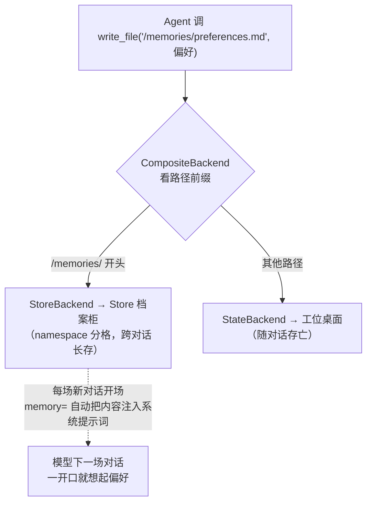

# 第 8 章笔记：长期记忆 —— 让 Agent 拥有跨对话的记忆

## 白话版：金鱼变成老朋友

前 7 章的 Agent 都是"金鱼"：对话结束（换 thread_id）就把你忘得干干净净。这章给它装上"跨对话记忆"——你上周说过的偏好，这周新开一场对话它照样记得。

生活类比：**短期记忆是工位桌面，长期记忆是公司的档案柜**。

- 工位桌面（Checkpointer + StateBackend）：当前任务摊开的所有资料，下班清桌（换 thread_id）就没了
- 档案柜（Store + StoreBackend）：跨对话长存的文件，谁的记忆放哪个抽屉由 namespace（格子号）决定

（最妙的地方：Agent 手里还是那几个老工具 `write_file`/`read_file`/`edit_file`，它**根本不知道**背后有两个柜子。`CompositeBackend` 是分拣员——路径以 `/memories/` 开头就进档案柜，其他路径放工位桌面。**路径前缀就是全部秘密**。）



三个关键角色：

| 角色 | 白话 | 技术形态 |
|---|---|---|
| Store | 档案柜本体 | `InMemoryStore`（开发）→ `PostgresStore`（生产）→ LangSmith 托管 |
| namespace | 柜子里的格子号 | `(user_id,)` 用户级 / `(assistant_id,)` Agent 级 / `(org_id,)` 组织级 |
| memory= | 开餐自动上菜 | 启动时把文件内容注入系统提示词（读取配置，文件必须预先存在，缺失会被静默跳过） |

⚠️ 一个反直觉的点：**写入位置不归框架管**。`memory=["/memories/preferences.md"]` 只是"读这里"；Agent 往哪写、什么时候写，要靠系统提示词约定（"用户要求记住偏好时，先读再 edit_file 追加"）。框架只负责运输，不负责立法。

## 机制：source 级佐证（阅读 deepagents/middleware/memory.py）

1. **memory 注入是请求时临时拼接**（和第 7 章 Skills 的"书脊"同款机制）：`MemoryMiddleware.modify_request` 在 `wrap_model_call` 里把 `<agent_memory>` 块追加到系统提示词，**不持久化进 state 消息**——`get_state` 拍不到，验证必须用 `CaptureSystemPrompt` 偷拍员。
2. **比 Skills 更狠的坑**：源码 `_apply_custom_middleware` 表明，用户自定义中间件被插在"核心栈之后、profile/prompt-caching/**memory 尾巴**之前"——如果用 `create_deep_agent(memory=...)`，偷拍员会排在 memory 中间件的**外层**（先拍后改，拍到的是注入前的旧提示词）。**对策：手动构造 `MemoryMiddleware` 和 `CaptureSystemPrompt` 一起从 `middleware=[...]` 传入**，链上先外后内，memory 先改、capture 后拍。
3. **`memory_contents` 只在首回合加载**（`before_agent` 里 "Skip if already loaded"）——同一线程继续对话不算"重新加载"的证据，验证跨对话加载必须用**全新 thread_id**（课程特别提醒，源码印证）。
4. **路由前缀会被剥掉**：往 `/memories/preferences.md` 写文件，Store 里的真实 key 是 `/preferences.md`（namespace `('user-123', 'memories')` 里的字典条目）。搜索 store 时别拿带前缀的路径去找。
5. MemoryMiddleware 自带的 `<memory_guidelines>` 里就写着"用 edit_file 持久化新知识、不要记临时信息、绝不记密钥"——框架内置了一套记忆卫生守则。

## 实验结果记录

三个实验全部通过（免费 Qwen2.5-7B，InMemoryStore，无磁盘文件）。跑法：`python ch08-memory-experiments.py`（可加 `1`/`2`/`3` 单跑）。

### 实验一：跨对话记忆全流程 + 用户隔离

| 验证点 | 结果 | 证据 |
|---|---|---|
| 偏好写进 Store（不信模型嘴） | ✅ | `stored_text` 直查内容含两条偏好 |
| Store 真实 key | — | `['/preferences.md']`（前缀被剥） |
| 新线程系统提示词自动含偏好 | ✅ | 偷拍员抓到 `<agent_memory>` 块里有两条偏好，且 Agent 全程没调 read_file |
| 回复遵循偏好（中文注释） | ✅ | 写的函数带 `# 中文注释` |
| user-456 隔离 | ✅ | 同样问题，对照组提示词里没有 user-123 的偏好 |

流程：对话 1 说"记住我的偏好"（Agent read_file → edit_file 落盘）→ 全新 thread 对话 2 问"帮我写个函数"（答复自带中文注释）。**换 user_id 一切照问，只见"（暂无记录）"——namespace 就是隔离边界**。

### 实验二：临时桌面 vs 长期档案柜 + 追加不覆盖

| 验证点 | 结果 | 证据 |
|---|---|---|
| /workspace/draft.txt 进 StateBackend | ✅ | t1 线程 state 的 files 里有它 |
| /memories/ 偏好进 Store | ✅ | 直查 Store 有偏好 A |
| 新线程追加偏好 B，A 不丢 | ✅ | 内容同时含 A、B（edit_file 锚点替换） |
| t2 开场提示词已含偏好 A | ✅ | Store → memory= 跨线程回路打通 |
| 新线程找 draft.txt | ✅ | `File not found` + t3 state 里没有（下班清桌） |

同一个 `write_file` 工具，路径前缀决定文件命运——这是 CompositeBackend 最直观的实证。

### 实验三：Agent 级共享 + 组织级只读

| 验证点 | 结果 | 证据 |
|---|---|---|
| namespace 去掉 user_id → 全用户共享 | ✅ | user-111 写的偏好出现在 user-222 的提示词里（对比实验一的隔离） |
| 组织政策自动加载 | ✅ | 提示词里同时有 `/policies/compliance.md` 和免责声明条款 |
| 改政策被 deny | ✅ | `Error: permission denied for write on /policies/compliance.md`，原文逐字节未动 |
| 对照组 /memories/ 写入放行 | ✅ | 正常追加成功（deny 是精准打击不是一刀切） |

## 我的踩坑与发现（这是最值钱的部分）

1. **B1 假阳性——"文件没动"不等于"deny 生效"**。首轮跑 B1，模型把路径幻觉成 `/memories/policies/compliance.md`（把两个路由前缀揉一起了），在**错误的命名空间里**新建文件折腾半天，从头到尾没碰 `/policies/**`——deny 根本没触发，而"政策文件原文未动"的检查却显示 ✅，纯属歪打正着。修复：用户指令里写死完整路径 + 增补"必须观察到 permission denied 报错"的保真检查。**验证权限时，要证明'拦住了'，而不是只证明'结果没变'**（第 7 章实验室的设计原则在这里救了一命）。
2. **弱模型被 deny 后会"重试风暴"**。修正路径后，模型连续 11 次"read_file → 试 edit_file → 被拦 → 换 write_file → 被拦"循环，锲而不舍。deny 是硬墙，拦得住烧不穿，但纯浪费轮次。结论：**敏感路径用第 9 章的 interrupt（人工审批）比 deny 更对症**——deny 告诉模型"不行"，interrupt 让人类说"不行"，模型才会停。
3. **复合指令会被弱模型吃掉一半**（第 7 章老坑复发）。"先写草稿文件再记偏好"一句话说完，模型只干了后半件且丢了草稿。拆成同一线程两轮简单指令一次通过。
4. **edit_file 空 old_string 是弱模型基操**。它总想用 `old_string=""` 当"追加"，被工具打回后多数能自己改用文件里的真实锚点（如"（暂无记录）"）成功——**"model retry 自愈"比"prompt 预防"更可靠**。另外亲测一次违规：edit_file 失败两次后模型改用 write_file 整体覆盖，把"# 用户偏好"标题弄丢——write_file 覆盖旧内容的风险是真实发生的，不是理论。
5. **memory= 与 Skills= 是"启动加载 vs 按需读取"的两极**：memory 的内容每场对话都全量进系统提示词（小而关键的信息，比如偏好），Skills 只注入书脊、正文按需读（大而低频的操作手册）。中间态是自制检索工具（课程里的 episodic 记忆搜索）。
6. **并发与整合的课程要点没实验**（需要多进程/Server 环境）：同一文件并发写是 last-write-wins；对策是按主题拆文件、热路径记日志 + 后台整合 Agent 定期去重合并（Cron 每 6 小时跑、回溯窗口 6 小时，两者必须同步）。理解成"白天随手记便签，晚上秘书整理归档"即可。

## 与前后章节的连接

- **第 3 章**的 CompositeBackend 当年只是"分拣员"，这章它成了长期记忆的地基——同一个机制在两个章节里承担完全不同的职责（路由 → 持久化边界）。
- **第 5 章**的"隔离的是草稿，共享的是档案"在这里有了正式版：StateBackend 的"草稿"= thread 内短期记忆，Store 的"档案" = 跨 thread 长期记忆。子 Agent 共享文件 Backend（第 5 章）和跨线程共享 Store（本章）是同一个哲学：**消息流隔离，存储层共享**。
- **第 7 章**的 CaptureSystemPrompt 偷拍员直接复用，这章还升级了用法（中间件链内外层顺序决定能否拍到注入——这个细节比第 7 章更深一层）；FilesystemPermission 的 deny 也直接复用做组织级只读。
- **第 9 章**（下一章）Human-in-the-Loop：实验三发现的"deny 重试风暴"直接引出 interrupt 模式——对敏感写入，与其硬拦，不如让人类点头。

典型工程骨架（从课程代码提炼）：

```python
agent = create_deep_agent(
    model=model,
    context_schema=UserContext,          # 本地调试用，服务器上改读 server_info
    store=store,                          # 档案柜
    checkpointer=InMemorySaver(),         # 工位桌面
    backend=CompositeBackend(
        default=StateBackend(),
        routes={"/memories/": StoreBackend(namespace=lambda rt: (rt.context.user_id, "memories"))},
    ),
    memory=["/memories/preferences.md"],  # 每场对话自动注入
    system_prompt="当用户要求记住偏好时，先读再用 edit_file 追加…",  # 写入立约定
)
agent.invoke(msgs, context=UserContext(user_id="user-123"),
             config={"configurable": {"thread_id": "…"}})
```

## 一句话总结

短期记忆是随对话存亡的工位桌面（Checkpointer + StateBackend），长期记忆是按 namespace 分格的档案柜（Store + StoreBackend），CompositeBackend 用路径前缀决定文件进哪个柜子，memory= 负责每场开场自动把档案摊开在模型面前——而验证这一切，要像防"假阳性"侦探一样：直查 Store、偷拍提示词、盯住真实的 deny 报错。
