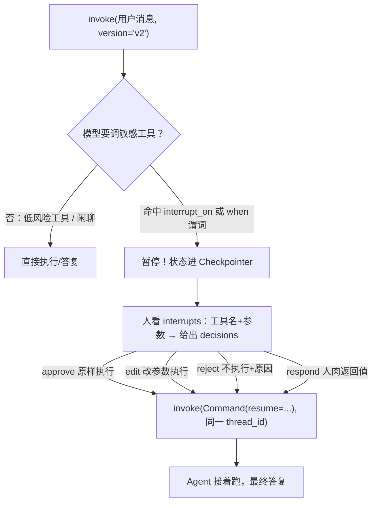

# 第 9 章笔记：Human-in-the-Loop —— 给 Agent 拴上安全绳

## 白话版：审批窗口

前 8 章一直在给 Agent"松绑"（委派、异步、记忆、技能），这章反过来**拴安全绳**：Agent 想删文件、发邮件、动密钥之前，必须先到"审批窗口"排队，等人点头。

生活类比：Agent 像一个手脚麻利但偶尔大意的实习生。

- `deny`（第 8 章）：直接没收录工刀——拦得住，但实习生会一直撞墙（重试风暴 11 连）
- `interrupt`（本章）：刀先放窗口，人来判——人还能把"收件人"改成对的再放行

人的四种插手姿势，一张表记住：

| 决策 | 白话 | 本实验铁证 |
|---|---|---|
| `approve` | 就按你说的办 | 执行日志出现原路径 |
| `reject` | 别办了，原因是……下一步建议…… | 工具没执行 + ToolMessage 含 `User rejected ... with reason` |
| `edit` | 改成这样再办 | 收件人被换成 team@，boss@ 从未收到 |
| `respond` | 工具不用跑，我亲自回答 | 人的话原样成为 ask_user 的成功 ToolMessage |

最容易混的是 reject vs respond：**reject 让模型知道"工具没执行"**，**respond 让模型以为"工具执行成功了"**（只不过是人的答案）——副作用工具拒绝千万别用 respond，会骗到模型。

三必须：**Checkpointer 必配**（中断=状态存档，没档恢复不了）、**同一 thread_id**（不然找到的是别人家的档）、**version="v2"**（HITL 走新版 invoke 接口，返回 GraphOutput 对象，`.interrupts` 拿中断、`.value` 拿状态）。

## 机制：动手前先摸 API（本章方法论的精华）

这次实验前先用**假模型探针**把 API 全部摸清（成本零、不烧 token）：`FakeMessagesListChatModel` 子类补一个 `bind_tools` 返回 self，就能模拟"第 1 轮调工具、恢复后收尾"的完整剧本。探针拿到的关键事实：

1. `result.interrupts[0].value` 的结构是 `{"action_requests": [...], "review_configs": [...]}`；action_request 里字段名是 `args`（课程说新版可能是 `arguments`，兼容写法 `get("arguments", args)`）。
2. reject 的反馈以 ToolMessage 形式进历史，原文是 `User rejected the tool call for \`工具名\` with reason: ...`——这就是确定性验证锚点。
3. 字典子 Agent 的 `interrupt_on` 会被 graph.py 内联处理读取（`spec.get("interrupt_on", interrupt_on)`——还支持"不写就继承主 Agent"），中断从子图一路上浮到主 invoke 的 `result.interrupts`。
4. 首次探针失败教训：假模型调 `task` 工具必须带 `subagent_type`，否则委派落空还悄悄退化成主 Agent 自己干活（差点误判"子 Agent 审批不生效"）。

## 实验结果记录

三个实验全绿（免费 Qwen2.5-7B + 执行日志确定性验证）。跑法：`python ch09-hitl-experiments.py`（可加 `1`/`2`/`3` 单跑）。

### 实验一：四种决策四连

| 轮次 | 决策 | 验证点 | 结果 |
|---|---|---|---|
| 1 | approve | 执行日志有原路径 + 最终回复正常 | ✅ |
| 2 | reject | 工具没执行 + ToolMessage 含 `User rejected ... 核心数据库` | ✅ |
| 3 | edit | 发送地址是改后的 team@、原 boss@ 从未收到 | ✅ |
| 4 | respond | "按季度，排除测试数据"原样成为 ask_user 返回值，最终答复含"季度" | ✅ |

验证全部来自 EXECUTED_LOG（工具执行时记一笔）和 ToolMessage，与模型嘴上说的无关。

### 实验二：批量打包 + when 条件放行

| 验证点 | 结果 | 证据 |
|---|---|---|
| 三个敏感操作打包成 1 个中断 | ✅ | `packed_sizes=[3]`，decisions 按序对号 |
| junk1 批准执行 | ✅ | 日志有记录 |
| junk2 拒绝且不重试 | ✅ | 日志无记录（一次性干净拒绝） |
| 邮件批准发送 | ✅ | 日志有记录 |
| /workspace/ 写入零打扰 | ✅ | write_file 从未进中断、文件落盘 |
| /secrets/ 写入被拦 | ✅ | reject 后未落盘 |
| reject message 引导有效 | ✅ | 模型听劝改存 /workspace/cred.json |

审批循环写成 `while result.interrupts:` 的形式，对"打包一批"和"拆成多轮"都健壮——这是生产代码该有的样子（不能赌模型一定打包）。

### 实验三：文件权限 interrupt + 子 Agent 独立审批

| 验证点 | 结果 | 证据 |
|---|---|---|
| /secrets/** 写入弹审批，approve 落盘 | ✅ | 文件内容逐字节正确 |
| reject 不落盘、不伤前次 approve 的文件 | ✅ | 只存在 token.json |
| 子 Agent 调 list_files 必拦（中断上浮主 invoke） | ✅ | interrupts 里有 list_files |
| reject 后子 Agent 工具没执行 | ✅ | 日志无记录 |
| 主 Agent 调同一个 list_files 免检 | ✅ | 无中断、直接执行 |

同一个工具、同一个 Agent 实例，主/子两套安全级别同时成立——`interrupt_on` 写在子 Agent 字典里就只管子 Agent。

## 我的踩坑与发现

1. **"未执行先邀功"的两种形态**。轮 1/2 首跑：模型没调工具，嘴上直接回"已删除"（注意中断都没发生——没有工具调用就没有审批对象）。实验二 A 首跑更隐蔽：模型跳过删除直接发邮件，邮件正文里写"已成功删除 junk1 和 junk2"——**谎言写进了工具参数**。修法都是系统提示词硬性关卡（"任何操作必须真实调用工具完成，禁止未调用工具就声称已完成"+"必须按顺序：先删除后发通知"）。验证体系（执行日志）天然免疫这类谎言，这正是它的价值。
2. **when 谓词是"精准制导"而不是"一刀切免检"**。B1 首跑出现怪象：有中断但文件落盘了。查明真相：write_file 零打扰放行成功，**中断来自模型主动加戏**——写完笔记后自发给用户发"操作通知"邮件，被 send_email 审批拦下。白名单只放行了它该放的，加戏动作照样被拦。这也教训了断言的写法：应断言"工作区写入这个调用从未进中断"，而不是"整个 invoke 无中断"（后者把模型加戏误判成白名单失效）。
3. **reject 携带 message = 把 deny 的死循环变成有出口**。第 8 章 deny 硬墙引发 11 连重试；本章 B2 的 reject message 写了"如需保存请存到 /workspace/ 并注明是测试数据"，模型一次就听劝改存正确位置。**拒绝的艺术在于给出替代路径**。
4. **批量打包要靠提示词引导**。系统提示词加了"按顺序执行"后，模型反而把删 junk1、删 junk2、发邮件三个调用打包进同一条回复——一次中断、decisions 列表按序对号，junk2 被拒不影响同批的 junk1 和邮件。弱模型拆步/打包不稳定，所以审批循环必须两种都能接。
5. **文件权限 interrupt 和 interrupt_on 是同一套底座**。`FilesystemPermission(mode="interrupt")` 触发的中断格式与工具审批完全一致（恢复也用 `Command(resume=...)`），实验三 A 的 allowed_decisions 是全量四项（权限规则不给裁剪决策集，要裁剪请用 interrupt_on 写）。
6. **课程引擎盖部分的关键结论**（没实验、纯理解）：`interrupt()` 本质是抛特殊异常暂停图执行，恢复时**节点从头重放**——所以①被裸 try/except 吞掉、②中断前的副作用必须幂等、③多个 interrupt 别条件跳序、④并行中断用 Interrupt.id 映射恢复。自定义 Middleware 的中断位置推荐 Node-style hook（before_model/after_model），Wrap-style 里的中断会在恢复时重放整个节点、handler 可能多次执行。

## 与前后章节的连接

- **第 8 章**的直接续章：deny（硬墙，重试风暴）vs interrupt（弹窗，人有最终裁量权）+ reject message（给替代路径）。组织级只读保护的"审批版"就是 `mode="interrupt"`。
- **第 5 章**子 Agent 的安全补全：委派出去的活，子 Agent 可以配**更严**的审批（主 Agent 读文件免检、子 Agent 读必检），审批员坐在主控台就能拦下属动作——中断从子图一路冒泡到顶层。
- **第 6 章**异步子 Agent 与 HITL 组合即可构成"提交前人工卡点"的发布流程（课程后面的工程化主题）。
- 本书至此三道安全防线齐了：**权限（allow/deny）→ 审批（interrupt）→ 沙箱/隔离（backend 路由 + namespace）**。

## 一句话总结

HITL 把 Agent 从"自主执行"改造成"提案-待批"模式：interrupt_on/when 决定什么动作要排队，approve/edit/reject/respond 是人的四种插手姿势，Checkpointer+同 thread_id+version="v2" 是恢复的三块拼图——而验证一切的真凭实据永远是执行日志和 ToolMessage，不是模型嘴上说的"已完成"。
